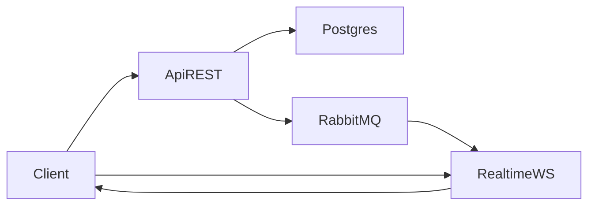

# EPIC 4 — Realtime (WebSockets) Learning Guide

This guide documents how EPIC 4 is implemented in OpsDesk: a **dedicated realtime service** that provides Socket.IO WebSockets with **JWT handshake authentication**, **per-ticket rooms**, and **server-side broadcasts** driven by **domain events**.

---

## What EPIC 4 requires (from `README.md`)

- Create a separate realtime service: `apps/realtime`
- Authenticate WebSocket connections via **JWT in the handshake**
- Use rooms per ticket: `ticket:{id}`
- Support realtime events:
  - `message:new`
  - `ticket:statusChanged`
  - `typing` (optional)
- Persist messages in PostgreSQL (already implemented via REST in `apps/api`)
- Basic scalability: Redis adapter (optional/bonus)

---

## Architecture overview

### Why a separate `apps/realtime` service?

Keeping WebSockets in a dedicated service mirrors real production setups:
- WebSocket connection lifecycles are different from request/response REST traffic
- Scaling WebSockets often requires different tuning and horizontal scaling rules
- A dedicated service is easier to observe and protect (rate limiting, connection caps)

### Dataflow



- **Write path**: clients persist messages through REST (`apps/api`), which writes to Postgres and publishes domain events to RabbitMQ
- **Read/broadcast path**: `apps/realtime` consumes those events and broadcasts them to the correct Socket.IO room

---

## Implementation details (step-by-step)

### Step 1 — Create the realtime service

Files:
- `apps/realtime/package.json`
- `apps/realtime/Dockerfile`
- `apps/realtime/src/main.ts`
- `apps/realtime/src/app.module.ts`

The service listens on `REALTIME_PORT` (default `3002`).

---

### Step 2 — Database access (read-only for EPIC 4)

Files:
- `apps/realtime/src/db/database.service.ts`
- `apps/realtime/src/db/schema/*`

Why it’s needed:
- To authorize `ticket.join`, we need to check ticket ownership (`tickets.owner_id`)
- In Keycloak mode, we need to map `sub` → internal user UUID (via `users.external_id`)

---

### Step 3 — JWT handshake authentication

Files:
- `apps/realtime/src/realtime/realtime-auth.service.ts`
- `apps/realtime/src/realtime/realtime.gateway.ts`

How it works:
- Socket.IO middleware runs during the handshake (`server.use(...)`)
- Token sources:
  - `socket.handshake.auth.token`
  - `Authorization: Bearer <token>` header

Modes:
- **Local mode** (`AUTH_MODE=local`): verify using `JWT_SECRET`
- **Keycloak mode** (default): verify using JWKS from `OIDC_ISSUER`, then resolve `sub` to internal user ID

Result:
- `socket.data.user = { id, roles, permissions }`

---

### Step 4 — Room authorization for `ticket.join`

Files:
- `apps/realtime/src/realtime/realtime.gateway.ts`
- `apps/realtime/src/realtime/tickets.repository.ts`

Rules (matches API behavior in `apps/api/src/auth/ownership.ts`):
- `admin` and `agent` can join any ticket room
- `customer` can only join rooms for tickets they own (`ticket.owner_id === user.id`)

Room name:
- `ticket:{ticketId}`

---

### Step 5 — Broadcasting events (RabbitMQ → Socket.IO)

Files:
- `apps/realtime/src/messaging/rabbitmq-consumer.service.ts`

Bindings:
- Exchange: `opsdesk.events`
- Routing keys:
  - `message.sent`
  - `ticket.status_changed`

Event mapping (EPIC 4 names):
- Domain `message.sent` → broadcast `message:new` to `ticket:{ticketId}`
- Domain `ticket.status_changed` → broadcast `ticket:statusChanged` to `ticket:{ticketId}`

---

### Step 6 — Docker Compose wiring

File:
- `docker-compose.yml`

Added service:
- `realtime` on port `3002`

---

## How to test locally

### 1) Start the stack (and confirm ports)

```bash
docker compose up
```

In a second terminal, confirm the services are up and that realtime is listening on **3002**:

```bash
docker compose ps
ss -ltnp | grep -E ':3000\\b|:3002\\b' || true
```

Notes:
- API runs on `http://localhost:3000`
- Realtime (Socket.IO) runs on `http://localhost:3002`

### 2) Get a JWT (fresh token)

- Local mode: use `POST /auth/login` on the API to obtain a token
- Keycloak mode: obtain a Keycloak access token and ensure `OIDC_ISSUER` is configured

#### Option A — Keycloak mode (recommended for this repo)

Get a **fresh** access token (don’t reuse old ones: expired tokens cause `401 Unauthorized` on REST):

```bash
curl -s -X POST "http://localhost:8080/realms/opsdesk/protocol/openid-connect/token" \
  -H "content-type: application/x-www-form-urlencoded" \
  -d "grant_type=password&client_id=opsdesk-api&username=<USERNAME>&password=<PASSWORD>" \
  | jq -r .access_token
```

If Keycloak returns a client error about secrets, add `client_secret=...` (Keycloak UI → Clients → `opsdesk-api` → Credentials).

Quick “is my token expired?” check:

```bash
TOKEN="<PASTE_TOKEN>"
node -e "const t=process.env.TOKEN; const p=JSON.parse(Buffer.from(t.split('.')[1].replace(/-/g,'+').replace(/_/g,'/'),'base64').toString()); console.log({exp:p.exp, now:Math.floor(Date.now()/1000), iss:p.iss});" 
```

#### Option B — Local mode (JWT_SECRET)

If running with `AUTH_MODE=local`, get a token from the API:

```bash
curl -s -X POST "http://localhost:3000/auth/login" \
  -H "content-type: application/json" \
  -d '{"email":"<EMAIL>","password":"<PASSWORD>"}'
```

Copy the `accessToken` field.

### 3) Connect to Socket.IO (using the repo’s test script)

The repo includes a ready-to-run Socket.IO client script:
- `apps/api/src/scripts/ws-test.ts`

Run it from the scripts directory:

```bash
cd apps/api/src/scripts
TOKEN="<PASTE_TOKEN>" TICKET_ID="<TICKET_UUID>" npx ts-node ws-test.ts
```

Expected output:
- `connected: <socketId>`
- `sent ticket.join: <ticketId>`

If you get `Connection error: xhr poll error`, it usually means realtime isn’t actually listening on port 3002 (check `docker compose logs realtime`).

If you get `Connection error: Invalid token`, ensure you’re using a **fresh** token (see step 2) and that you’re using the correct auth mode.

### 4) Trigger EPIC4 events via REST and observe WS broadcasts

Keep `ws-test.ts` running (it joins the room `ticket:{id}`), then in another terminal trigger:

#### A) `ticket:statusChanged`

```bash
TOKEN="<PASTE_TOKEN>"
TICKET_ID="<TICKET_UUID>"

curl -i -X PATCH "http://localhost:3000/v1/tickets/$TICKET_ID/status" \
  -H "authorization: Bearer $TOKEN" \
  -H "content-type: application/json" \
  -d '{"status":"closed"}'
```

You should see `ticket:statusChanged` printed by the WS client.

If you get `401`, the token is missing/expired/invalid (most commonly expired).

#### B) `message:new`

```bash
TOKEN="<PASTE_TOKEN>"
TICKET_ID="<TICKET_UUID>"

curl -i -X POST "http://localhost:3000/v1/messages" \
  -H "authorization: Bearer $TOKEN" \
  -H "content-type: application/json" \
  -d "{\"ticketId\":\"$TICKET_ID\",\"authorId\":\"00000000-0000-0000-0000-000000000000\",\"content\":\"hello\"}"
```

You should see `message:new` printed by the WS client.

Note: `CreateMessageDto` currently includes `authorId`; the controller uses `req.user.id`, but the DTO validation may still require this field, so we include a placeholder UUID for testing.

### 5) What just happened (event path)

- REST writes happen in `apps/api`
- API publishes domain events to RabbitMQ (`opsdesk.events`)
- `apps/realtime` consumes:
  - `message.sent` → broadcasts `message:new`
  - `ticket.status_changed` → broadcasts `ticket:statusChanged`
- Your Socket.IO client receives those events because it joined `ticket:{id}`

---

## Troubleshooting

- **401 / Invalid token**:
  - Ensure `AUTH_MODE` matches how you obtained the token
  - Local: `JWT_SECRET` must match API signing secret
  - Keycloak: `OIDC_ISSUER` must be the realm issuer URL; JWKS must be reachable from the container

- **Join denied**:
  - Ensure you joined with a user that can access the ticket (role or owner match)
  - In Keycloak mode, confirm the user row exists (or allow auto-resolution via `users.external_id`)

- **No events received**:
  - Ensure API is publishing to `opsdesk.events`
  - Ensure realtime queue is bound to the correct routing keys
  - Ensure you joined the correct room name: `ticket:{id}`

