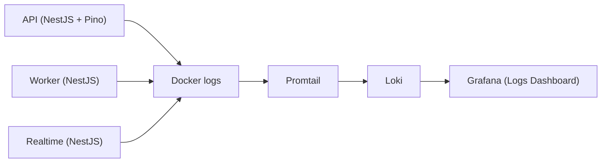

# EPIC 8 — Logs & Loki - Learning Guide

## Overview

This guide explains how structured logs flow from the OpsDesk services (API, Worker, Realtime) into Loki and Grafana, and how to use them for debugging and observability.

---

## Log Pipeline

1. **API**, **Worker**, and **Realtime** write logs to stdout (JSON in production, pretty-printed in dev).
2. **Docker** captures stdout/stderr into JSON log files under `/var/lib/docker/containers/`.
3. **Promtail** discovers and tails those log files, enriches them with labels (`service`, `container`, `stream`), and pushes to Loki.
4. **Loki** stores logs with an index for efficient querying.
5. **Grafana** queries Loki to visualize and search logs.

---

## Log Fields by Service

### API (Pino + nestjs-pino)

- **`req.id` / `request_id`**: Comes from `x-request-id` header. The `requestIdMiddleware` runs first and sets `req.headers['x-request-id']` (or generates a UUID). `nestjs-pino` is configured with `genReqId: (req) => req.headers['x-request-id']` so pino-http uses that value as `req.id` in every request log.
- **`service`**: Promtail derives this from the container name (`opsdesk-api` → `api`) and adds it as a Loki label.
- **`user_id`**, **`ticket_id`**: When available, these can be added by application code via `this.logger.log({ userId, ticketId }, 'message')`. The HTTP exception filter includes `requestId` in error responses.

### Worker (Nest Logger)

- Uses Nest's default `Logger`; logs are plain text or simple JSON.
- **`service`**: Promtail adds it from the container name (`opsdesk-worker` → `worker`).
- **`request_id`**: Not applicable (no HTTP requests); worker logs are event-centric.

### Realtime (Nest Logger)

- Uses Nest's default `Logger`.
- **`service`**: Promtail adds it from the container name (`opsdesk-realtime` → `realtime`).
- **`request_id`**: Not applicable for non-HTTP flows; WebSocket connection logs may include context.

---

## Correlation: Following a Request

To trace all logs for a single API request:

1. Send a request with a custom `x-request-id` header, e.g. `curl -H "x-request-id: my-trace-123" http://localhost:8888/api/health`.
2. In Grafana Explore (Loki datasource), query: `{service="api"} |= "my-trace-123"` or `{service="api"} | json | request_id="my-trace-123"` (if logs are JSON).
3. All log lines for that request will share the same `request_id`.

---

## Example Loki Queries

| Query | Description |
|-------|-------------|
| `{service="api"}` | All API logs |
| `{service="worker"}` | All worker logs |
| `{service="realtime"}` | All realtime logs |
| `{service="api"} \|= "error"` | API logs containing "error" |
| `{service="api"} \| json \| level="error"` | API error-level logs (JSON) |
| `{container=~"opsdesk-.+"}` | Logs from all OpsDesk containers |

---

## Configuration Reference

- **Loki**: `monitoring/loki/loki-config.yml` — filesystem storage, in-memory ring.
- **Promtail**: `monitoring/promtail/promtail-config.yml` — Docker service discovery for `opsdesk-api`, `opsdesk-worker`, `opsdesk-realtime`; relabels `container` and `service`.
- **API Logger**: `apps/api/src/logger/logger.module.ts` — `genReqId` wired to `x-request-id`; `requestIdMiddleware` in `main.ts` runs before the logger.
